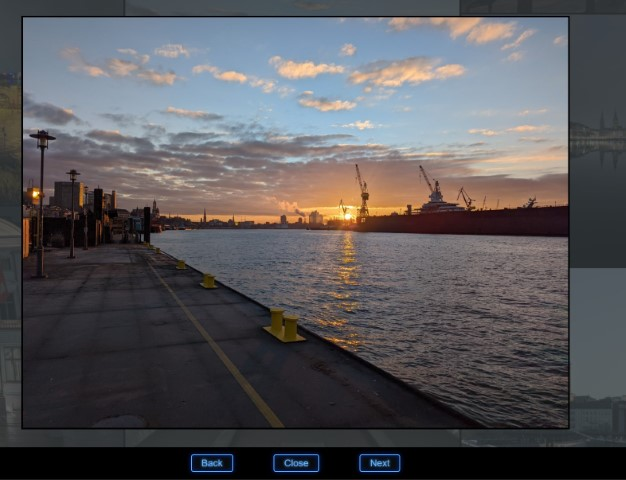

# Simple Lightbox

Ths project features a simple lighbox for photos for any kind of HTML website. It uses HTML, CSS and JavaScript. The goal was to make it as customizable as possible and easy to integrade into existing websites and projects. Since this is a project to learn coding, it is completely free. You can use it, modify it and redistribute how ever you intend to. Features are:

* A simple lightbox four the photos of your website
* Navigation with icons and with (keyboard) keys

___
## How the files are sorted

`index.html`: This file loads the demo files and shows the Simple lighbox in action. You can use it or delete it if you don't need it.

`styles.css`: Found in folder `css`: This file contains the CSS for 'index.html'. 

`lightbox.css`: Found in folder `css`: This file contains the CSS statements for the lightbox. If you want to use it, feel fre to import it into your own CSS main file or into your own index.html

`main.js`: This file contains all the JavaScript to make the Lightbox magic happen. 
Example Photos are found in folder `img`. 

Folder `images`: Place here your pictures you want to show in the gallery. Add the paths to 'index.html' as it is done with the example files. You already will find some example images from my beautiful hometown Hamburg.  

___
## Purpose of this project

I currently teach myself to code. This is my first project I want to publish to the public. I know that I am not a pro. This is also the reason why I want to offer this project for free and under a free license. All files and photos are under a free license. That means: Do what you want with it. Steal it, modify it, use it commercially, whatever your heart tells you to do. If you like it, I'm happy. This is my small contribution to this great world. 
